# Notes of awesome works in image editing

---

## Training-based Approaches

以下部分主要介绍基于训练的方法，这种方法通常使用较大规模的数据集对预训练的扩散模型进行进一步的训练(而不是微调)，该种方法又可以更进一步地分为如下几类：

### Weak Supervision

较早期的工作主要在相对小规模的数据集上进行研究，并通过弱监督的方式来训练模型。这一类工作虽然是基于训练的，但是大多数并不通用，大多无法通过用户提供的文本或者其他信号进行直接编辑。一般来说，以下的大多数工作都是从特定的 domain 迁移到另外一个特定的 domain 中，比如 "Cat" → "Dog"，"Smile" → "Angry"。而迁移的图像也是符合这些 domain 的而不能是 wild 的。

| 模型                                                       | 概要                                                         |
| :--------------------------------------------------------- | :----------------------------------------------------------- |
| DiffusionCLIP (**CVPR**) (2021/10)                   | 
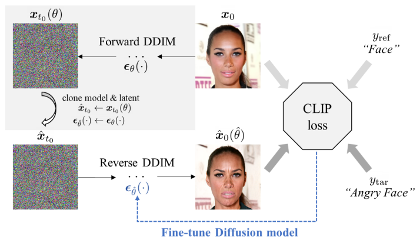 https://arxiv.org/pdf/2110.02711。GAN inversion的方法存在诸多问题，比如无法编辑图像使其有新的姿势、角度等，并会改变目标的ID或者产生人造痕迹。为了解决这些问题本文提出了DiffusionCLIP： 首先明确要一个事情：这个方法不是基于SD模型的，他的核心思路是通过 CLIP direction loss 将 CLIP 模型中的知识取出，这种方法称为 **CLIP Guidance**。**这个模型虽然是一个基于训练的模型，但是对于每一对$y_{ref}$和$y_{tar}$都要训练一个模型，一个模型只能进行一种编辑，即从比如“face”到“angry face”的编辑，而不是可以接受任何编辑文本**。其训练方法较为简单，对于全体样本 $\{x_0^{i}\}_{i=1}^N$ 先使用pretrained模型将其进行DDIM inversion (这里的 inversion 是不基于 source prompt 的 inversion)，然后再reverse的过程中使用两项损失对其进行约束：其一是CLIP direction损失，其用于约束编辑结果 $\hat x_0(\hat\theta)$ 与编辑prompt $y_{tar}$ 的相关程度来保证编辑的有效性；另外一项损失是 ID 损失，用于约束编辑结果与源图像 $x_0$ 的一致性。 这个训练过程中使用CLIP direction loss 直接进行监督，而没有 ground-truth，是一种很典型的弱监督方式。 |
| Diffusion Autoencoders (CVPR) (2021/11)              | https://arxiv.org/pdf/2111.15640。虽然扩散模型的功能强大，但是其使用了一些列没有语义的特征(噪声)，这些特征并不能被应用于其他的任务上。本文章的目标是探索是否可以将扩散模型用于特征学习，是否可以通过自编码 (autoencoding) 的方式提取一些有语义和可解码的特征表示。这个方法的核心思想是将一个图像编码分为两部分：一部分保存语义且这部分保存语义的编码是可以**线性可加的**，由此就可以**通过线性插值实现编辑**；一部分保存随机相关的信息。这种编码方式可以实现GAN难以实现的编辑任务。 
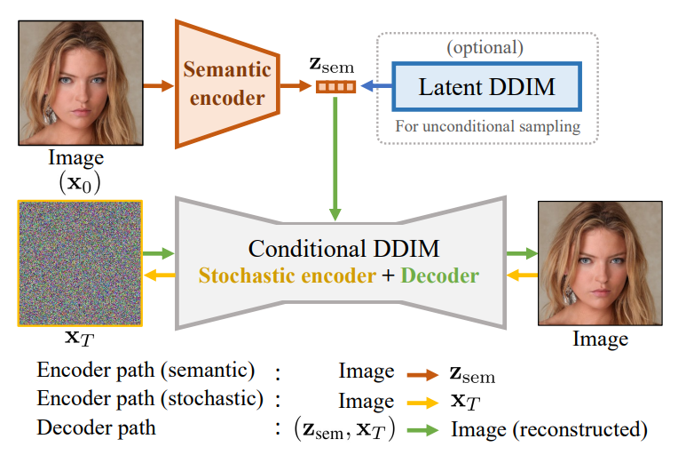 文章首先提出了一个观点，即扩散模型的噪声 latent(注意这里不是LDM的 latent 的意思)只能保存结构信息而无法保存语义信息，所以需要一个额外的编码器用于编码图像的语义信息。一个图像的编码由两部分组成，即：$z_{sem}$ 与 $x_T$。该方法由如下几部分组成： 第一：语义编码器。其首先使用一个编码器编码图像的语义，文章中声明这个编码器不假设拥有特殊结构，但是文章使用了扩散模型U-Net的左一半作为其结构，来提取语义信息表征 $z_{sem}$。 第二：条件DDIM。这个DDIM是一个条件扩散模型，其基于语义信息表征 $z_{sem}$ 去重建图像。训练的损失函数为：$L=\sum_{t=1}^T\mathbb E_{x_0,\epsilon_t}[||\epsilon_{theta}(x_t,t,z_{sem})-\epsilon_t||_2^2]$。其中 $\epsilon_t\sim \mathcal N(0,I)$，即是从随机噪声中采样进行训练的。换句话说，在训练时假设初始点 $x_T$ (随机编码)是随机噪声。模型的目标就是**从任意的随机噪声中都可以基于 $z_{sem}$ 重建图像**。 第三：条件DDIM作为 Stochasti Encoder。可以使用训练好的 DDIM 模型通过 inversion 来得到随机编码 $x_T$。但是这一部分并**不会作为任务参与训练**，而是在训练完成后直接使用。这个 subcode 被用于比如精准重建和编辑的任务中。 额外的第四：Latent DDIM。当模型完成训练后出现一个问题，整个模型变成了一个大号的自编码器，而不是一个生成模型了。DDIM 模型在其中只充当编码器，而没有建模图像分布。所以其对全体图像的语义编码 $z_{sem}$ 又训练了一个 DDIM 模型用于学习 $z_{sem}$ 的分布。然后就可以用这个模型进行采样从而来进行生成。  这是一个相对这一组其他模型更通用的方法，不局限于特定的prompt pair或者风格。 |
| EGSDE (NeurIPS) (2022/7)                           | https://arxiv.org/pdf/2207.06635。朱军、Fan Bao组的文章。这篇文章的任务是  Unpaired I2I Translation，这个任务的目标就是使用**未配对的数据**来训练一个模型对可以将图像**从 domain $\mathcal X$ 迁移到 domain $\mathcal Y$，对于一次训练得到的模型来说这个迁移是固定的**，比如 Cat → Dog，Male → Female。其直接使用了宋飏博士 *Score-based Generative Modeling Through Stochastic Differential Equations* 一文中的 Time-reverse SDE。这篇文章直接对 score-based model 的 score estimate 部分加入了能量指导，然后直接通过求解 time-reverse SDE 来进行生成，在整个过程中并未给出 Forward SDE 的显式形式，这是一个有一点讨巧的做法。其具体做法如下： 其设计了两种能量：一个是 domain-specific energy，主要负责将生成过程迁移到目标 domain 中，其衡量当前位置 $y$ 与原图的相似度，$y$ 的应该向着相似度降低的方向移动；另一项是 domain-independent energy，主要负责保持和迁移无关的，比如图像的结构等信息的一致性，其实现是通过一个低通滤波器来过滤出结构相关信息，然后和原图的结构信息作差异上的约束，$y$ 的应该向着差异小的方向移动。在模型根据 score estimate 进行朗之万运动时，还需要尽量降低这两项能量，从而保证模型既能生成特定 domain 的图像，又能保持原始图像的结构与其他特征。其 Time-reverse SDE 形如： $\mathrm d y=[f(y,t)-g(t)^2(s(y,t)-\nabla_y \mathcal E(y,x_0,t))]\mathrm d t+g(t)\mathrm d \bar w$。 其中 $x_0$ 是原图，$x_t$ 是原图加噪，$y$ 是当前位置，$\mathcal E$ 是能量，由两部分组成。 |
| Asyrp (**ICLR notable**) (2022/10)                   | https://arxiv.org/pdf/2210.10960。本文认为扩散模型缺乏一个明确的语义空间(semantic latent space) 来明确地控制生成过程。为了解决这个问题，研究者们提出了Asyrp来研究**冻结的** pretrained model 的语义空间，本文中称为 h-space，基于该 h-space 可以对图像进行各种语义上的 manipulation。 其首先定义了一个**编辑失效**的问题：对于DDIM的 reverse(sampling) 过程而言，其可以写作 $x_{t-1}=\sqrt{\alpha_{t-1}}P_t(\epsilon_t^\theta(x_t))+D_t(\epsilon_t^\theta(x_t))+\sigma_t z_t$。在这个 sampling 的过程中如果只改变 $\epsilon_t^\theta$ 从而去修正噪声的预测，那么 $P_t$ 和 $D_t$ 会相互抵消让这个修正失效。假设修正前的 sampling 轨迹上的某点为 $x_t$，而修正后为 $\tilde x_t$，文章在Appendix C 中证明了 $x_t$ 与 $\tilde x_t$ 二者几乎相同，而这种相同是由于 schedule 中的 $\beta_t$ 值很小导致的。 为了应对编辑失效的问题，本文提出了一种非对称(asymmetric) 的 sampling 过程，即 $x_{t-1}=\sqrt{\alpha_{t-1}}P_t(\tilde\epsilon_t^\theta(x_t))+D_t(\epsilon_t^\theta(x_t))+\sigma_t z_t$。其中 $\tilde\epsilon_t^\theta$ 是微调过的模型，而 $\epsilon_t^\theta$ 为原模型。如此以来二者就不会发生相互抵消的作用。 而对于模型的微调方式也比较简单，并不是进行全局的微调，而是通过在U-Net的颈部(中间层的输出的feature map)上添加一个语义调整 $\triangle h$ 来实现，如图所示： 
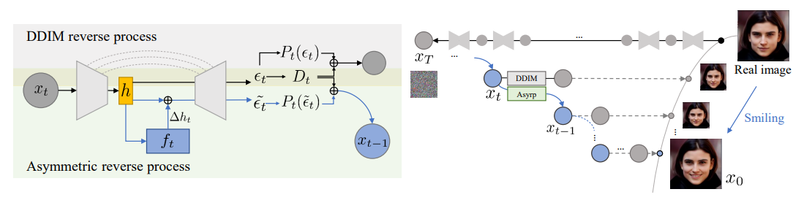 这个语义调整 $\triangle h$ 由一个小型的神经网络 $f_t$ 实现，其数学形式上的输入是时间步 $t$ 和特征图 $h_t$。这里仍然是用 **CLIP guidance 的弱监督方法**进行学习，每一种编辑方式都需要学习一个 $f$ 来进行。本文还提到，如果同时添加不同的 $\triangle h$ 到编辑过程中，还可以一次性实现多种编辑效果。 |
| DiffStyler (IEEE TNNLS) (CCF-B) (2022/11)         | https://ieeexplore.ieee.org/stamp/stamp.jsp?tp=&arnumber=10387416。这篇工作是风格迁移工作，其认为之前的工作的问题在于无法很好的 preserve 原图像的结构信息。为了解决此问题，改文章主要从以下两点进行了改进： 第一，其将扩散的过程从 $T$ 延长到了 $T_1$。在 $T_1$ 处，随机采样一个高斯噪声作为起点，然后先进行无条件(文中成为 free-diffusion，即使用 zero embedding 作为条件)的去噪到 $T$ 步骤上，然后基于这个 $x_T$ 进行推理(文章中的algorithm就是如此写的)。**这听上去就很不合理，因为这个并非一种inversion操作，而且即便是inversion操作都无法做到很好地从噪声中重建图像，更何况从随机噪声中以无条件采样进行去噪，这怎么会能保持住原图像的信息？我认为研究者可能直接使用了加噪加了一半的噪声图像作为起点，而不是从随机噪声进行所谓的“free-diffusion”** 第二，其使用两个模型进行推理。这两个模型分别在不同的数据集上进行训练，第一个在真实图像数据集 Conceptual 12M 上进行训练，其余一个在 WikiArt 上进行训练。两个模型分别负责学习图像的真实概念和艺术风格，在推理时对二者进行插值使用。 该文章结构混乱，语言表达及其不清晰，如果不是我没看懂的话，这篇文章关于所谓 free diffusion 的描写就是**纯胡说八道**。 |
| Pixel-Guided Diffusion (CVPR Workshop) (2023/12) | https://arxiv.org/pdf/2212.02024。本文的方法比较简单直接，是使用类似 classifier-guidace 的方法使用语义图对模型的扩散过程进行指导。该方法先训练一个较小的网络，以扩散模型的中间层结果为输入来进行语义分割。该文章指出，相比使用时间步 $t$ 作为输入，不如直接对每一个时间步 $t$ 都训练一个自己的分割网络 $G_t$，因为这个网络太小了能力有限。模型的工作流如下： 
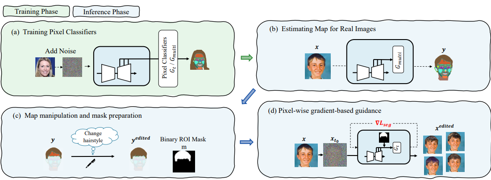 其分为四步：(1) 预训练像素分类器 $G_t$；(2) 使用 $t=50,150,200$ 三个时间步的分割结果来对面部像素进行最终的分类，以用于后续用户编辑的语义图；(3) 用户手工编辑语义图作为指导；(4) 分割模型 $G_t$ 本身是一个 classifier，以用户编辑的语义图结果作为分类目标，使用 classifier-guidance 来编辑图像。 这是一篇像素空间上的工作。 |
| EffDiff (preprint) (2023/4)                          | https://arxiv.org/pdf/2304.04344。是一篇来自俄罗斯互联网企业Yandex的工作。本文认为当前的编辑工作虽然效果好(其实那个时间段的工作效果也很差)但是计算开销大，所以该文章主要集中在降低计算开销，提升速度上。 该方法仍然使用 CLIP Guidance 的方法，在2023年出现就相对过时了。该工作有一个观点：当图像扩散到 $x_t$ 时已经可以较好地保留语义信息，根据 $x_t$ 预测得到的 $x_0(t;\theta)$ 有高频信息缺失，但是其语义不应该被后面的步骤改变。所以文章基于此对于 DiffusionCLIP 做了一个改进，即在模型使用 CLIP direction loss 训练的阶段只去训练从时间步 $t=t_0$ 到 $t=0$ 这一步预测的能力。而在预测阶段，则从原图加噪到 $x_{t_0}$，然后从这个时间步开始正常使用 DDIM 开始逐步预测。因为其在 $t_0$ 步骤已经将语义修改，后面对于高频细节信息的添加也不会影响到这个时间步上语义的改变。 |
| HDAD (WACV) (2023/4)                                 | https://arxiv.org/pdf/2304.11829。本文提出了一个观点，就是如 Diffusion Autoencoder 这样的工作只使用一个语义编码来编码图像实际上损失了很多细节信息。所以该方法采用了一种多级的方式，使用一个语义编码器提取不同级别的语义。此外，还可以通过不同的方式来使用这些不同级别的特征来实现不同的目的。其模型框架图如下： 
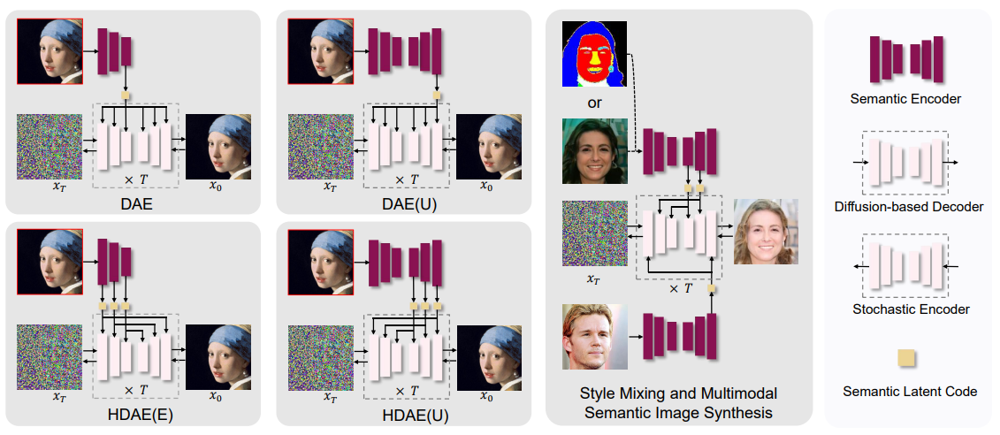 |
| StyleDiffusion (ICCV) (2023/8)                       | https://arxiv.org/pdf/2308.07863。内容和风格的解耦是风格迁移的基本问题，但是目前也并没有做好。本文提出了一个 Content-style 解耦的迁移框架。核心在于显式地提取内容信息，隐式地学习风格信息，可以实现可解释、可控的 disentanglement。 
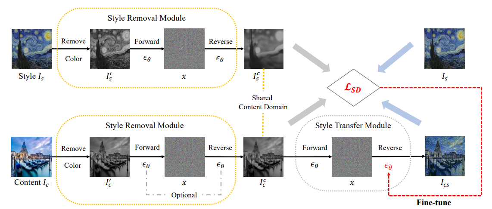 方法的主体包含两部分：第一部分是风格去除模块，其具体的方法是将风格参考图像 $I_s$ 和内容图像(待迁移) $I_c$ 都变为黑白图像后使用扩散模型对其进行重建。这里有一个假设：不同风格图像属于不同跟的 domain，如果使用进行重建的预训练扩散模型是在一个 domain 的数据上进行过训练，那么其重建的结果就都会是同一个 domain 中的图像。这个重建的过程使用了 DDIM 的 forward 和 sampling 方法。第二部分是一个风格迁移模块，其使用风格迁移的损失对扩散模型进行微调。需要说明的是，一次训练是针对一张风格参考图像 $I_s$ 的，模型训练完成后可以将任意其他图像迁移到参考图像 $I_s$ 的风格上。 此处**简要说明一下这里如何进行解耦**：对于风格参考图像 $I_s$ 在进行风格移除后，得到该图像的内容信息图像 $I_s^c$，一个最直观的得到风格信息的方法就是对二者在像素级别直接作差，即 $D_s^{px}=I_s-I_s^c$。但是这种像素级别的相减意义不大，因为其捕捉不到语义。所以使用一个预训练的编码器对其进行编码后再进行相减是更合理的，比如CLIP的图像编码器就能很好的提取出风格的语义，所以使用更改编码器对风格信息进行提取，即 $D_s=E(I_s)-E(I_s^c)$。然后根据根据提取的风格信息再进行比如 $L_1$ 损失或者余弦损失的设计即可。 |
| CycleNet (NeurIPS) (2023/10)                         | https://arxiv.org/pdf/2310.13165。效果很一般，不如 P2P+NullText。但是 cycle 这种渐进的思想有点意思。 
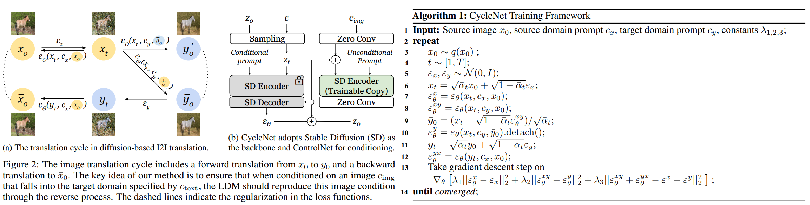 本文的任务被称为 Unpaired I2I Translation，这个任务的目标就是使用未配对的数据来训练一个模型对可以将图像**从 domain $\mathcal X$ 迁移到 domain $\mathcal Y$，对于一个模型来说这个迁移是固定的**。由于其使用的是 Text-guided 的扩散模型，所以**文本 prompt 也是固定的**，比如 "$\mathcal X$: horse" → "$\mathcal Y$: zebra"。另外，这个扩散模型不仅有 text prompt 作为条件，还使用 controlNet 将图像也作为条件注入 U-Net，注意图中的 uncontional prompt 类似于 negative prompt，用于消除概念(就以negative prompt的方法就很容易实现)。 其流程如下： ① 基于 $x_0$ 和取自标准高斯噪声的 $\epsilon_x$ 构建 $x_t$; ② 使用 $\epsilon^x_\theta(x_t,c_x,x_0)$ 重建 $x_0$ 让模型学习 domain $\mathcal X$ 的领域知识 ③ 使用 $\epsilon^{xy}_\theta(x_t,c_y,x_0)$ 预测 $\bar y_0$ ③ 基于 $\bar y_0$ 和取自标准高斯噪声的 $\epsilon_y$ 构建 $y_t$ ④ 使用上述变量计算损失 上面的 $c_x = \{CLIP(l_x)，CLIP(l_y)\}$ 分别对应 conditional 与 unconditional，其中 $l$ 为文本 prompt。 **该方法的核心就是：当以 $c_{img}$ 为参考条件时，要保证最后的生成结果落入$c_{text}$对应的 domain 中**。所以损失中，**文本条件和预测目标是对应的**。具体地，其使用如下三项损失： ①  $L_{x\rightarrow x}=E_{x_0,\epsilon_x}||x_0-G(x_t,c_x,x_0)||=\mathbb E_{x_0,\epsilon_x}||\epsilon_\theta(x_t,c_x,x_0)-\epsilon_x||^2_2$，学习 学习 $\mathcal X$ 的领域内知识 ② $L_{x\rightarrow y \rightarrow x}=E_{x_0,\epsilon_x,\epsilon_y}||x_0-G(y_t,c_x,x_0)||$，学习 $\mathcal Y\rightarrow \mathcal X$ 的映射。因为其实这是个**典型的弱监督**，$x_0$ 的结构信息(ControlNet部分提取结构信息，下文解释了)和 $y_t$ 应当是一样的，所以这里的生成模型就是要从一个带噪的 $y_t$ 根据文本条件 $c_x$ 和 $x_0$ 的结构信息将其 translate 为 $x_0$。 ③ $L_{x\rightarrow y \rightarrow y}=E_{x_0,\epsilon_x}||\bar y_0-G(x_t,c_y,\bar y_0)||$，学习 $\mathcal X\rightarrow \mathcal Y$ 的映射，其作用机制和上一条类似。 且这个损失使对称使用的，交换领域 $\mathcal X$ 与 $\mathcal Y$ 的位置后则得到对称的损失，二者相加为完整的损失。 在推理时，使用的是 $\epsilon_\theta(y_t,c_y,x_0)$，这个 sampling 过程的初始化输入的是加噪的 input image，也就是加噪的 $x_0$。(**使用DDIM的closed form进行逐步的去噪**) 对此进行较粗粒度的**理解**：首先，损失①会让**模型分别学习到两个领域各自的知识**这才是最重要的。具体讲，图像生成到哪一个 domain 由输入的 Condtional prompt 决定。使用特定的 prompt 就能够生成该领域的图像。其次，ControlNet 中引用 unconditional prompt 用来消除与 condition 相反的概念，我认为可以粗略地理解为这样能够得到结构信息，**文章中举得 summer to winter 的例子好像是写反了的？**。这样看来实际上就是 ControlNet 给出 source image 消除概念后的结构信息，然后依靠 backbone model 通过文本 prompt 来进行编辑的事情，但是因为数据是 unpaired，所以损失的设计比较复杂。 |

---

### Self-Supervision

| 模型                                          | 概要                                                         |
| --------------------------------------------- | ------------------------------------------------------------ |
| PbE (CVPR) (2022/11)                  | https://arxiv.org/pdf/2211.13227。这篇文章首次探索了 examplar-guided 的图像编辑技术，其核心思路是通过自监督的训练来 disentangle 和 re-organize 原图像与参考样例。该方法的框架比较简单，如下图所示： 
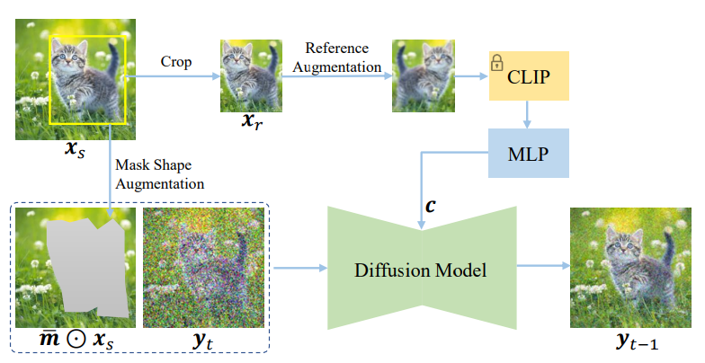 该方法利用了预训练的 stable diffusion 作为先验。该模型的训练过程有一个难点就是容易形成 copy and paste 的结果。为了避免这一结果，其中有两点值得特别说明：其一是增强，其对 crop 得到的参考图像进行增强，另外是对 mask 基于 bounding box (构建自监督数据时的box)进行增强；其二是本文提出了一种  information bottleneck，其不适用 patch-level 的参考图像特征，而是将其再用 MLP 压缩为一个 embedding，强迫模型必须理解语义而不是进行 copy and paste。 |
| ObjectStitch (CVPR) (2022/12)         | https://openaccess.thecvf.com/content/CVPR2023/papers/Song_ObjectStitch_Object_Compositing_With_Diffusion_Model_CVPR_2023_paper.pdf。该文章的任务定义为 object compositing，是向 base image 中插入某个 object。其认为志传统的方式无法将 object 很好的融入图像，在颜色、形状、视角等方面存在较大问题。而若是要构建高质量数据集成本很高。所以改文章提出了一种自监督的方法微调 conditional diffusion model 来完成该任务。其做法与 PbE 类似，示意图如下： 
 该方法同样基本上也是基于 inpainting 的范式，然后对作为自监督参考图像，即 crop 出来的图像部分进行增强。最终作为条件的是去除了背景的对象(使用语义分割的 mask 提取后的对象)。有一点值得说明的是 content adapter，如上图所示。模型其首先使用 CLIP image encoder 提取图像的特征，然后将其输入 content adapter。这个 content adapter 的训练分为两阶段，如上图中的右图所示。第一阶段的预训练首先在一个 image-caption 训练集上进行，让 adapter 最终输出的编码特征包含高级语义。第二阶段的训练则是加入到扩散模型中一起训练。 我认为这一部分对于所谓高级语义的训练解释的不是非常到位，因为文本和图像都使用 CLIP encoder 编码，二者本身就是对齐的。不如 PbE 中的 information bottleneck 的解释合理。 |
| SmartBrush (CVPR) (2022/12)         | https://openaccess.thecvf.com/content/CVPR2023/papers/Xie_SmartBrush_Text_and_Shape_Guided_Object_Inpainting_With_Diffusion_Model_CVPR_2023_paper.pdf。文章想要对文本指导的 inpainting 模式进行改进，改为基于文本和形状来进行 inpainting，实际上就是加上了一个条件的参考模态。模型的结构并不复杂，如下图所示： 
 对于 mask 的处理有一些 trick 比较值得注意：① 该方法为扩散模型增加了一个额外的输出通道，输出对于生成目标的精准 mask 的预测。这个预测被原图像的准确的语义图 m 约束得到一个损失 $\mathcal L_{prediction}$。这一项损失可以保证在 mask 不精确时(极端情况就是一个box)，某些不该被改变的背景不会被改变。② 为了适应不同类型的 mask 输入，其对 mask 做了增强。其设计了一个 precision indicator $s\in[0,S]$，当 $s=0$ 时就是一个精确的语义分割图，而当 $s=S$ 时就是一个 box。这个 indicator $s$ 也作为输入输入到扩散模型中，但是文章中貌似没有明确指出如何将 $s$ 进行嵌入和使用(也可能是我没看到)。③ 其为模型的生成设计了 multi-task，因为文章不希望模型只使用语义分割 domain 的数据。具体地，其也是用 stable diffusion 使用的数据集进行训练。其直接使用一个覆盖整个图像的 box 作为 mask，来进行文生图的训练。这两项不同的任务是 joint training 的。 |
| Imagen Editor (CVPR) (2022/12)      | https://openaccess.thecvf.com/content/CVPR2023/papers/Wang_Imagen_Editor_and_EditBench_Advancing_and_Evaluating_Text-Guided_Image_Inpainting_CVPR_2023_paper.pdf。这篇文章是 Google reaserch 的工作，基于其自己的 Imagen 模型上实践的。方法就是一个很简单的将图像中某个 object 遮盖后进行重建的方法。这篇文章说明，使用 boundingbox 完全遮罩要生成的 object 要比随机 mask 要好(这不是废话吗？)。其他就没什么值得特别关注的了，而且文章没有详细说明训练数据中的 mask 区域对应的准确的文本 prompt 是如何构造的。 |
| PAIR Diffusion (CVPR) (2023/3)      | https://openaccess.thecvf.com/content/CVPR2024/papers/Goel_PAIR_Diffusion_A_Comprehensive_Multimodal_Object-Level_Image_Editor_CVPR_2024_paper.pdf。该文章认为先前的工作缺乏细粒度的编辑能力，无法实现 object-level 的控制。文章提出了如下的控制方式： 
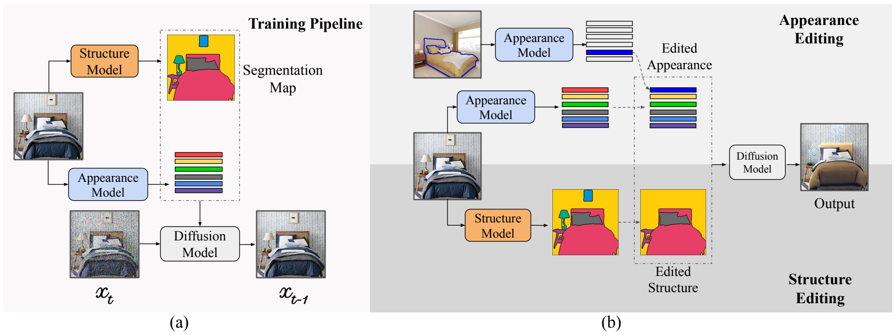 首先其将图像解耦为两部分特征，语义图和图像中各个 object 的外观特征。语义图特征由一个其他的语义分割模型直接得到。而后根据语义图中存在的 object，模型会对各个 object 提取各自的特征。提取的具体方式为，使用 VGG 的第 $l_1$ 层提取低级特征，使用 DINOv2 的第 $l_2$ 和 $l_3$ 层输出提取高级语义特征。在提取第 $i$ 个 object 的特征时，直接使用其语义图的 mask $m_i$ 哈达玛乘在特征图上 (我认为这个 mask 应该下采样过以适应该特征大小)，然后对各个位置上的特征求平均得到最后的结果，记作：  $g_i^l={\Large \frac{\sum_{j,k}E_g^l(x)\odot m_i}{\sum_{j,k}m_i}} $。 式子中的 $\{j,k\}$ 指的应该是空间上的 patch 位置。该文章的**外观特征这里有一点点像 StyleGAN，不过这里的粒度是图像中的各个 object**。模型在训练时，使用语义图和外观特征作指导来重建原图像。在编辑时，如果希望编辑外观，以上图中跟的床为例，就需要拿另外一张床的外观特征做替换。而如果希望编辑结构，比如上图中移除床头的画和台灯，则直接对语义图进行编辑即可。 |
| RIC (CVPR Workshop) (2023/3)          | https://arxiv.org/pdf/2304.09748。这篇文章的整体结构与思路与 PbE 类似，但是引入了 sketch 这个新模态作为监督信号。其使用与 PbE 一样的自监督方式，对 crop 得到的参考信息进行增强，使其与原本的形状发生偏差，再使用原图像对应部分的 sketch 作为条件去重建原图像。其示意以及与其他方法的对比如下： 
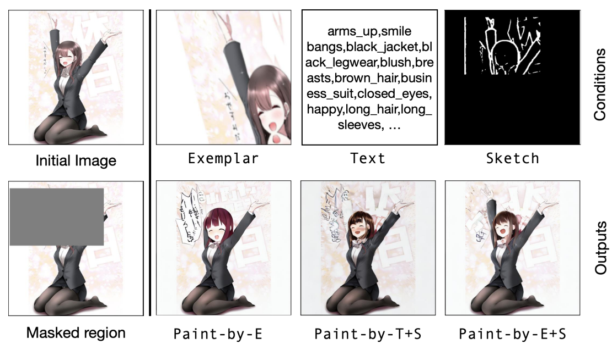 |
| IIR-Net (WACV) (2023/5)             | https://arxiv.org/pdf/2305.17489。该模型的全称为 *Image Information Removal Module*，其大概意思就是如果直接使用原图像作监督可能会导致 copy and paste 的问题，所以在以原图像为指导时需要进行特殊的处理。其主要提到了两种处理：其一是对ROI进行颜色消除(使用SAM做分割后对需要编辑的部分去除颜色信息)；其二是对全图加噪来消除纹理。 虽然文章的思路简单，但是表述却很混乱，且没有规范化的符号系统。比如输入图像的文本到底是要编辑区域的描述文本呢？还是整个图像的描述文本呢？例如 Fig 1 中使用了 "Airplane is flying in the sunset"，这是一张对全局的描述，那如何决定那部分是 ROI 呢？又比如 abstract 的逻辑之混乱令人咂舌。 |
| PhD (preprint) (2023/6)              | https://arxiv.org/pdf/2306.07596。本文名称为 Paste, Inpaint and Harmonize via Denoising，即通过去噪来实现粘贴和 inpainting 和和谐化，即将示例图 insert 到背景图中。 
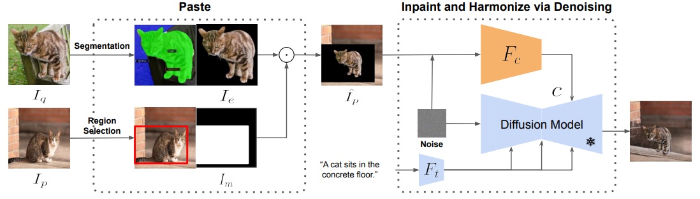 该方法比较简单直接，思路和 PbE 类似，但有三个细节不同：① 是图像特征提取器的结构不同，这里采用 ControlNet；② 为了保留扩散模型的先验知识，其冻结了扩散模型的 U-Net，这一点与 PbE 不同；③ 扩散模型是 SD v1.5 而不是 inpainting 模型。 |
| AnyDoor (CVPR) (2023/7)             | https://arxiv.org/pdf/2307.09481。该文章名为 *AnyDoor: Zero-shot Object-level Image Customization*。该文强调不针对某个 object 微调模型，所以需要更强的模型能力，需要对一般常用的 ID 特征进行补充，补充一些细节特征。模型的整体机构比较简单，这里描述较重要的三点：① 对于 ID 提取使用了一个自监督训练模型 DINOv2 作为特征提取器，文章认为自监督模型的表征可以 preserve 更多的 discriminative features。② 其将去除背景后的原图像的高频信息 HF-Map 拼贴到场景图中(被称为 collage)，然后和 shape mask 连接起来输入到模型中。③ 其使用 shape mask 控制最终生成结果的姿势和形状。 
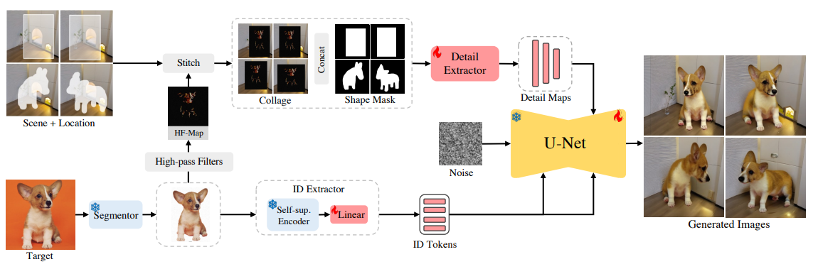 值得一提的是，该文在数据上应用了**视频数据集**来构建一些变化的数据对，来应对一些编辑情形。本文最终使用了三种类型的数据：视频数据集、多视角图像数据集、图像数据集(这个数据集无法构建该文章所需的 variation)。对于视频数据的处理如下图所示： 
 对于第一帧，通过语义分割从视频中识别出前景，移除背景后将一个 object 从图像中 crop 出来。对于第二帧：使用 boundingbox 定位同一个 object，基于该 box 对原图像进行 crop，并使用该 box 作为 loacation 的 mask，得到 scene + location。而没被 box  遮盖的则作为监督信号。 语义分割的语义图(在作模拟用户输入的处理后)还作为 mask shape control 使用。 |
| FADING (BMVC) (CCF-C) (2023/9) | https://arxiv.org/pdf/2309.11321。一个非常简单的方法，是一个改变人像年龄的小型子任务。该模型的训练和编辑时的 framework 都简单直接，如下所示： 
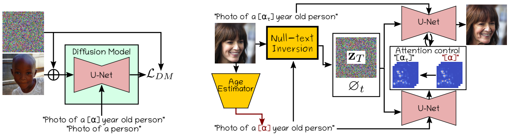 作图为该模型的训练，实际上就是将一个预训练的图像生产模型在年龄数据集的 domain 上做进一步的微调。该文章发现，在训练是同时使用年龄 prompt $P_\alpha$: "Photo of a [α] year old person" 和普通 prompt $P$: "Photo od a person" 会有更好的表现，其损失函数如下： $\mathcal L_{DM}=\mathbb E_{Z_0 \sim\mathcal E(x),\alpha,\mathcal E,\mathcal E',t}[||\mathcal E-\mathcal E_\theta(z_t,t,P)||^2_2+||\mathcal E'-\mathcal E_\theta(z'_t,t,P_\alpha)||_2^2]$。 而右图则是推理时，则使用了 Null-textual Inversion 和 Prompt2Prompt 的方法，在 prompt 上进行了年龄的修改，比较简单直接。 |
| Uni-paint (MM) (2023/10)            | https://arxiv.org/pdf/2310.07222。该文章指出之前工作都局限于单一的模态和特定的任务，所以其提出了一个基于预训练扩散模型的统一多种 inpainting 的框架，可以提供多种 inpainting 的方式。该工作主要提供了三种编辑方式：stroke、text 和 exemplar。该文章提出了一种有点刻奇的 inpainting 训练方式，即重建已知区域(不需要 inpainting 的区域)，该文章认为这种方式可以让模型更好地理解已知区域。 但是其在对重绘已知区域做完训练后，为了更好地保持背景的一致性，又要在推理时候进行所谓的 blending。其原文写的是 *where the known part of sampled latent $x_t$ is replaced by noised $x^{in}$ after each sampling step.* 这就是早期基本的 inpainting 方式(4通道 inpainting 时期，那时模型的输入就只有加噪的原图，即 latents。mask 以及 masked_iamge_latent 不会一起 concat 起来输入到 U-Net 中，所以需要这样的 blending 操作。现在9通道 inpainting 方式已经不用这么做了，现在的情形是：预测噪声还是作用在原图加噪得到的 latent 那4个通道上，但是有 mask 和 masked_image_latent 做条件，就不再需要这种 blending 了)。 |
| DreamInpainter (preprint) (2023/12)   | https://arxiv.org/pdf/2312.03771。这篇文章虽然以 Dream 为名，但是并没有使用 test-time finetuning 的方式。其核心思路是使用一些列 tokens 来表征参考图像，然后生成 subject-driven 的图像。 
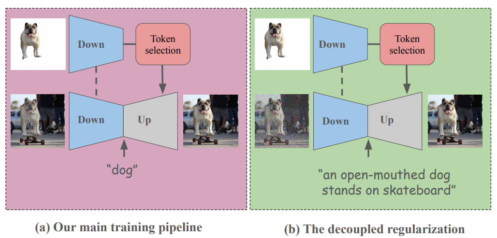 这篇文章有两个值得关注的点：① 是其对 ID 特征提取的设计。其没有直接使用 CLIP encoder 一类的预训练提取器，而是使用扩散模型的下采样部分来提取特征。在提取特征时，其将时间步设置为0(这里我有点疑惑，有点记不太清在U-Net训练时有没有针对 $t=0$ 进行训练了，这个时间步上是直接 identity 函数还是怎样来的？)。而后其发现一个问题，如果使用这个特征直接作为参考那么会发生 copy and paste 的问题。所以其提出了一种 token selection 的方案，其通过设计一些相似度计算，在图像的 patch tokens 中选出最不相同跟的几个作为最终的 ID tokens。② 是针对生成结果无视文本 prompt 的问题，其提出了一种所谓的 Decoupling regularization 的训练策略。其发现只通过训练数据中的文本标注过于简单，因为在构造 inpainting 的数据的过程中，往往使用语义分割的 label 作为文本 prompt，比如 "Dog"。这种信号太弱了，导致模型只依赖于图像的特征即可，可以忽视文本 prompt。所以其设计了两种加噪方式，一种是 inpainting 的，另外一种是全图加噪而后根据原图像的文本描述重建全图，强制模型去关注文本 prompt。 |
| PowerPaint (ECCV) (2023/12)         |                                                              |
| SmartMask (CVPR) (2023/12)          |                                                              |

---

### Full-Supervision 

| 模型 | 概要 |
| ---- | ---- |
|      |      |
|      |      |
|      |      |
|      |      |

